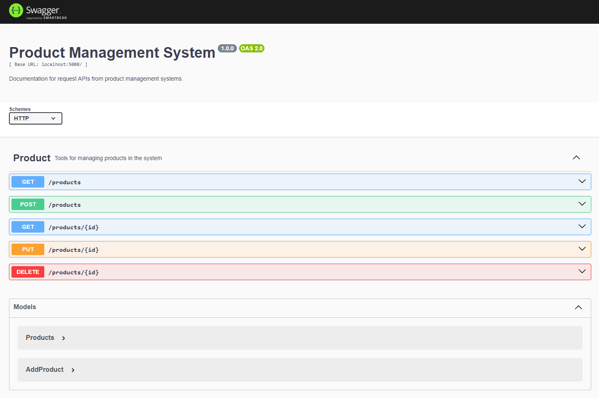

# ระบบจัดการสินค้า (Product Management System) ด้วย Node.js และ Express

Task Week 2 : Back-End Dev for Dev Init

เมื่อผู้ใช้ Run ระบบจัดการสินค้านี้ ด้วย Code
```
npm run start
```
ผู้ใช้จะสามารถเข้าไปอ่าน คู่มือการใช้งาน API ของระบบจัดการสินค้า ได้ที่นี่ [Product Management System Documentation](http://localhost:5000/doc)

จากในรูป Swagger ของ Product Management System แสดงให้เห็นว่า มีคำสั่งที่ใช้ในการจัดการสินค้าอยู่ทั้งหมด 5 คำสั่ง คือ
- คำสั่ง Get All
- คำสั่ง Get by id
- คำสั่ง Post
- คำสั่ง Put
- คำสั่ง Delete

เริ่มที่ประเภทคำสั่งแบบ `Get` ประกอบด้วยคำสั่ง Get All และ Get by id โดยคำสั่ง `Get All` จะเป็นคำสั่งสำหรับเรียกดูข้อมูลของสินค้าทั้งหมดที่มีอยู่ในระบบ ซึ่งผู้ใช้จะต้องทำการ Request แบบ `Get` ไปที่ API
```
http://localhost:5000/products
```
จากนั้นข้อมูลของสินค้าทั้งหมดที่มีอยู่ในระบบก็จะถูกแสดงออกมาอยู่ในรูปแบบ ดังนี้
```
[
  {
    "id": 1,
    "name": "Laptop",
    "category": "Electronics",
    "price": 1000,
    "stock": 5
  },
  {
    "id": 2,
    "name": "Phone",
    "category": "Electronics",
    "price": 500,
    "stock": 10
  }
]
```
- จากในตัวอย่างจะเห็นได้ว่าในระบบจัดการสินค้าของเรามีสินค้าอยู่ 2 รายการ คือ Laptop และ Phone

ส่วนคำสั่ง `Get by id` จะเป็นคำสั่งสำหรับค้นหาข้อมูลของสินค้าที่ผู้ใช้ต้องการจะเรียกดูจากในระบบ โดยดูจากเลขรหัสสินค้า (id) ที่ผู้ใช้ทำการกรอกเข้ามาผ่านการ Request แบบ `Get` ไปที่ API
```
http://localhost:5000/products/{id}
```
เช่นเมื่อผู้ใช้ Request แบบ `Get` ไปที่ API `http://localhost:5000/products/1` จากนั้นข้อมูลของสินค้าในระบบที่มีเลขรหัสสินค้าเป็น 1 ก็จะถูกแสดงออกมาอยู่ในรูปแบบ ดังนี้
```
{
    "id": 1,
    "name": "Laptop",
    "category": "Electronics",
    "price": 1000,
    "stock": 5
}
```
- จากในตัวอย่างเราก็จะได้ข้อมูลของสินค้าในระบบที่มีเลขรหัสสินค้าเป็น 1 นั่นก็คือ Laptop นั่นเอง

ต่อมาคือคำสั่ง `Post` เป็นคำสั่งสำหรับให้ผู้ใช้เพิ่มรายการสินค้าเข้าไปในระบบจัดการสินค้าผ่านการ Request แบบ `Post` และส่งข้อมูลของสินค้าที่ต้องการจะเพิ่มในระบบไปที่ API
```
//API
http://localhost:5000/products

//New product information
{
    "name": "Keyboard",
    "category": "Electronics",
    "price": 700,
    "stock": 3
}
```
- จากในตัวอย่างเราได้เพิ่มข้อมูลสินค้าที่ชื่อ Keyboard ลงไปในระบบ ทำให้เมื่อเราใช้คำสั่ง `Get ALl` เราจะเห็นว่ามีสินค้าอยู่ในระบบจัดการสินค้าของเราทั้งสิ้น 3 รายการ
```
[
    {
        "id": 1,
        "name": "Laptop",
        "category": "Electronics",
        "price": 1000,
        "stock": 5
    },
    {
        "id": 2,
        "name": "Phone",
        "category": "Electronics",
        "price": 500,
        "stock": 10
    },
    {
        "id": 3,
        "name": "Keyboard",
        "category": "Electronics",
        "price": 700,
        "stock": 3
    }
]
```
มาต่อกันที่คำสั่ง `Put` เป็นคำสั่งสำหรับให้ผู้ใช้ทำการ Update ข้อมูลของสินค้าในระบบ โดยผู้ใช้จะต้องทำการระบุเลขรหัสสินค้า (id) และข้อมูลที่ต้องการจะแก้ไขผ่านการ Request แบบ `Put` ไปที่ API
```
http://localhost:5000/products/{id}
```
อย่างในกรณีนี้ ถ้าเราต้องการจะเปลี่ยน Price ของ Phone จาก 500 เป็น 900 เราก็จะต้อง Request แบบ `Put` ไปที่ API แบบนี้
```
//API
http://localhost:5000/products/2

//Edit product information
{
    "price": 900
}
```
- เมื่อเราส่ง Request ร้องขอการแก้ไขข้อมูลแบบนี้ไป และนี่คือสิ่งที่ระบบจัดการสินค้าของเราได้ทำการ Update เมื่อเราใช้คำสั่ง `Get ALl` จะเห็นว่าระบบได้ทำการแก้ไข ราคาของโทรศัพท์มือถือจาก 500 บาท เป็น 900 บาทเรียบร้อยแล้ว
```
{
    "id": 2,
    "name": "Phone",
    "category": "Electronics",
    "price": "900",
    "stock": 10
}
```

สุดท้ายคือคำสั่ง `Delete` เป็นคำสั่งสำหรับให้ผู้ใช้ลบข้อมูลสินค้าออกไปจากระบบ โดยผู้ใช้จะต้องทำการระบุเลขรหัสสินค้า (id) ที่ต้องการจะลบผ่านการ Request แบบ `Delete` ไปที่ API
```
http://localhost:5000/products/{id}
```
เช่นเมื่อผู้ใช้ Request แบบ `Delete` ไปที่ API `http://localhost:5000/products/1` จากนั้นข้อมูลของสินค้าในระบบที่มีเลขรหัสสินค้าเป็น 1 ก็จะถูกลบออกไปจากระบบ ทำให้เหลือข้อมูลสินค้าอยู่ในระบบจัดการสินค้าของเราเพียงแค่ 2 รายการ คือ Phone และ Keyboard ดังตัวอย่าง
```
[
    {
        "id": 2,
        "name": "Phone",
        "category": "Electronics",
        "price": "900",
        "stock": 10
    },
    {
        "id": 3,
        "name": "Keyboard",
        "category": "Electronics",
        "price": 700,
        "stock": 3
    }
]
```